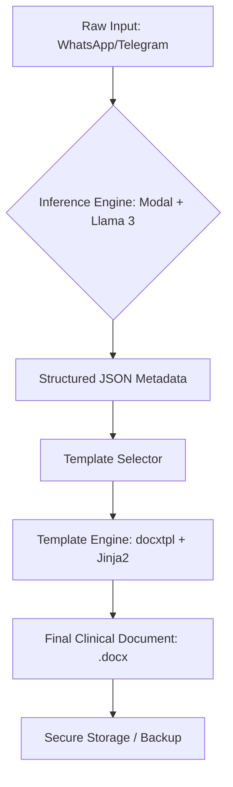

# 🩺 Automated Clinical Scribe
### *Bridging Medical Accuracy and Engineering Rigor*

The **Automated Clinical Scribe** is a production-grade pipeline designed to solve one of the most significant bottlenecks in healthcare: documentation burnout. 

---

## 🏗️ Architecture & Pipeline
The scribe uses a metadata-driven approach to transform raw, unstructured inputs (voice-to-text, quick telegram/whatsapp notes) into structured, pathologically accurate hospital documents.

### **The Pipeline Flow:**

1.  **Input Ingestion:** Capturing raw clinical observations in the field (ER, ICU, Rounds).
2.  **Context Injection:** Mapping clinical jargon to standardized medical terminology (Spanish/Venezuelan context).
3.  **Inference Engine:** Utilizing **vLLM (Llama 3 8B)** hosted on **Modal** for high-speed processing.
4.  **Template Rendering:** Populating sanitized hospital templates using `docxtpl` and `Jinja2`.

---

## 🛠️ Tech Stack
- **Inference:** vLLM, Modal (Serverless GPU).
- **Backend:** Python, FastAPI, Pydantic.
- **Rendering:** Docxtpl, Jinja2.
- **Evaluations:** Custom Hamel-style eval framework.

---

## 📁 Project Structure
- `src/`: Core logic for the inference pipeline and document generation.
- `templates/`: Sanitized `.docx` templates used for rendering clinical documents.
- `docs/`: Technical documentation and evaluation framework details.

---

## 🔬 Clinical Evaluation & Safety
In medicine, "almost right" is dangerous. Our evaluation framework focuses on:
- **Pathological Consistency:** Does the assessment match the clinical findings?
- **Entity Extraction:** Accurate mapping of medications, dosages, and vital signs.
- **Structural Integrity:** Ensuring the final DOCX meets hospital requirements.

---

## 🚀 Roadmap
- [x] Initial Pipeline & Template Rendering logic.
- [x] Modal Deployment for vLLM Server.
- [ ] Implement "Proactive Filling" for complex evolution notes.
- [ ] Scale evaluation framework for multi-doctor beta testing.

---

## 🐶 About the Project
Developed by **Pastor Soto (MD & AI/ML Engineer)** as part of a mission to build the "Missing Middle" in healthcare technology.

*Disclaimer: This repository is for technical demonstration and version control of the pipeline logic. It does not contain Protected Health Information (PHI) or private patient datasets.*
